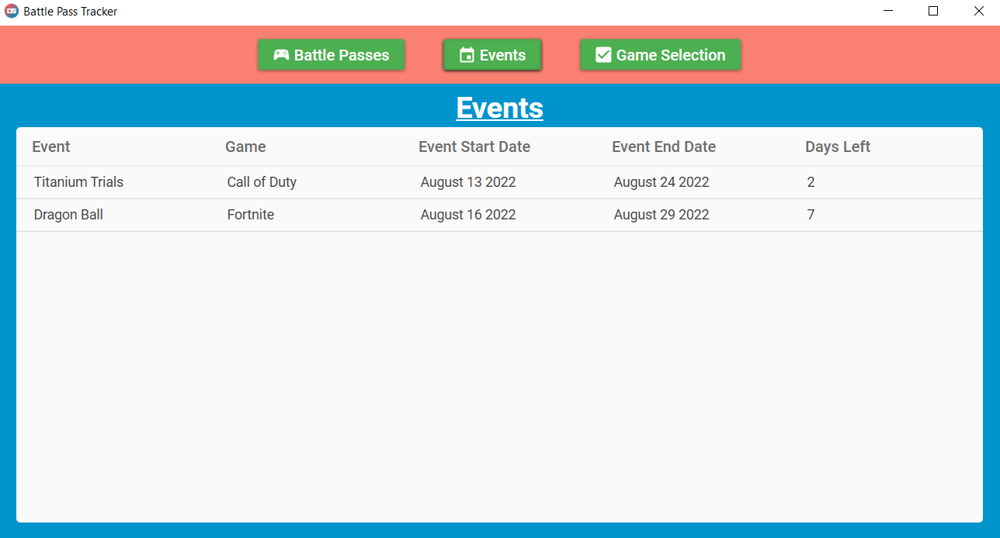
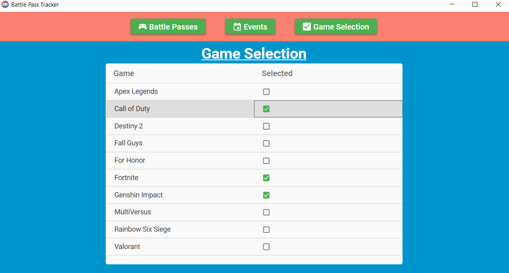

# Battle Pass Tracker for Windows
This is the Windows version of the Battle Pass Tracker Web Application that can be found [here](https://github.com/Jimmy-Du/battle-pass-tracker). The goal of this Windows application is to provide users a quick and easy way to view battle pass info 
for the games that they play. 

## Live Demo
Click [here](https://github.com/Jimmy-Du/battle-pass-tracker-wpf/releases/latest/download/BattlePassTracker-v1.0.0.zip) to start the download for the application. 

Then, visit the "Getting Started" section on this [page](https://github.com/Jimmy-Du/battle-pass-tracker-wpf/releases/tag/v1.0.0) for instructions on how to install and run the application.

## Built With
- .NET 6
- C#
- Mahapps Icons
- MaterialDesignInXaml
- WPF

## Web Version
For the web application version/repository click [here.](https://github.com/Jimmy-Du/battle-pass-tracker)

## Android Version
For the Android application version/repository click [here.](https://github.com/Jimmy-Du/battle-pass-tracker-android)

## Screenshots

  
  
  

