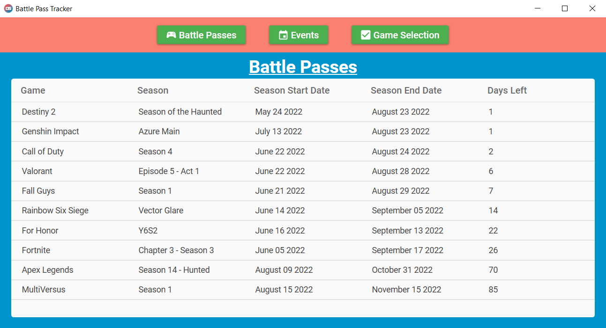

  
  <h1 align="center">Battle Pass Tracker</h1>
  <a href="https://github.com/Jimmy-Du/battle-pass-tracker-wpf/releases/tag/v1.0.0">View Demo</a>
  ·
  <a href="https://github.com/Jimmy-Du/battle-pass-tracker-wpf/issues">Report Bug</a>
  ·
  <a href="https://github.com/Jimmy-Du/battle-pass-tracker-wpf/issues">Request Feature</a>

## About The Project:

With more and more games adding battle passes and limited time in game events, it can be overwhelming to keep up with all of them. Battle Pass Tracker is an Android, web, and Windows application that displays the dates of battle passes and in game events of various video games. The goal of this project is to allow users to have a central hub where they can view the dates of the battle passes and in game events, of the games that they play, so that they can prioritize battle passes and events that are the closest to expiring in order to obtain all rewards given out by the video games.

## Built With:
<ul>
  <li>
    
  </li>
  <li>
    
  </li>
  <li>MaterialDesignInXAML</li>
  <li>Windows Platform Foundation</li>
</ul>

## Other Versions
This repo is for the Windows version of Battle Pass Tracker. Click on the links below to visit the repositories of the Android, or Web versions or to go to the Google Play Store to download it to your Android devices.
<ul>
  <li><a href='https://github.com/Jimmy-Du/battle-pass-tracker-android'>Android</a></li>
  <li><a href='https://github.com/Jimmy-Du/battle-pass-tracker'>Web</a></li>
</ul>

Google Play and the Google Play logo are trademarks of Google LLC.